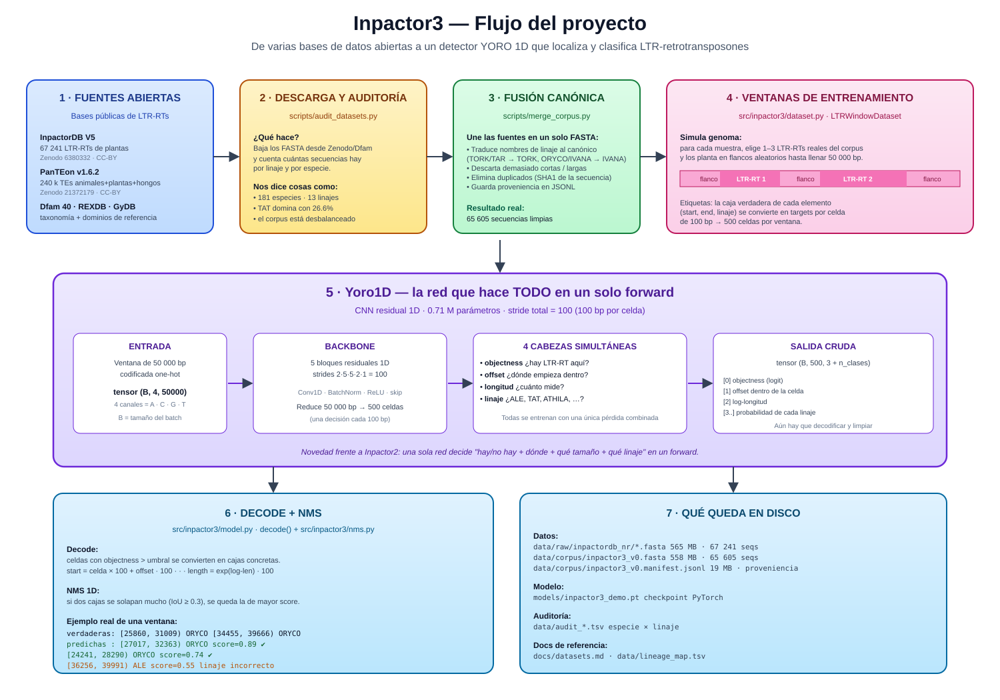

# Inpactor3

Clasificador generalizable de elementos transponibles (plantas, hongos, humano) que sustituye la red `Inpactor2_Class` dentro del pipeline de Inpactor2.

**Proyecto Integrador II** · Universidad de Caldas · agosto–diciembre 2026

## Flujo del proyecto



> Ver [FLUJO.svg](FLUJO.svg) en el navegador o VSCode para el diagrama completo.

## Contexto

Inpactor3 es un reemplazo de la red neuronal de clasificación (`Inpactor2_Class`) del pipeline Inpactor2, con el objetivo de generalizar la detección/clasificación de LTR-retrotransposones a distintos reinos (plantas, hongos, humano), no solo plantas.

Referencias del linaje del proyecto:

- Inpactor v1 (C + MPI) — referencia histórica: https://github.com/simonorozcoarias/Inpactor
- Inpactor2 (Deep Learning, Python) — software que se extiende: https://github.com/simonorozcoarias/Inpactor2

## Estructura del repositorio

```
Inpactor3/
├── data/         # Datasets (no versionar datos pesados; usar DVC o enlaces)
├── notebooks/    # Exploración, EDA, prototipos de arquitecturas
├── src/          # Código fuente del clasificador (entrenamiento, inferencia)
├── models/       # Pesos entrenados / checkpoints
├── tests/        # Pruebas unitarias e integración
├── scripts/      # Utilidades CLI, preprocesamiento, evaluación
├── docs/         # Documentación técnica, bitácora, entregables
└── README.md
```

## Estado

Semana 2 — repositorio inicializado. Próximo entregable según Lineamientos Generales v4.

## Reproducir el corpus tras clonar

Los datasets pesados **no se versionan aquí** (Zenodo/Dfam son la fuente de
verdad). Cualquiera que clone el repo regenera el corpus con estos pasos:

```bash
git clone https://github.com/Inpactor3/Inpactor3.git
cd Inpactor3

# 1) Entorno + dependencias
python -m venv .venv && source .venv/bin/activate
pip install -r requirements.txt

# 2) Descarga desde Zenodo (~155 MB, ~2 min con buen internet)
python scripts/audit_datasets.py --which inpactordb_nr

# 3) Fusión canónica → data/corpus/inpactor3_v0.fasta
python scripts/merge_corpus.py \
    --inpactordb data/raw/inpactordb_nr/InpactorDB_non_redundant_final_V5.fasta \
    --lineage-map data/lineage_map.tsv \
    --out data/corpus/inpactor3_v0.fasta \
    --manifest data/corpus/inpactor3_v0.manifest.jsonl

# 4) Entrenar la demo (~1 min en CPU)
python scripts/train_demo.py \
    --fasta data/corpus/inpactor3_v0.fasta \
    --epochs 5 --batch 2 --limit-ltrs 800 --windows 96 --det-thr 0.5
```

**Por qué no subimos los datos:**
- El corpus fusionado (~558 MB) excede el límite de 100 MB por archivo de GitHub.
- InpactorDB ya tiene DOI ([10.5281/zenodo.6380332](https://zenodo.org/records/6380332)); redistribuir aquí crearía una copia frágil.
- CC-BY exige atribución explícita por fuente — mejor que cada quien lo baje directo.
- El `.gitignore` ya excluye `data/raw/`, `data/corpus/*.fasta`, `.venv/` y `models/*.pt`.

**Qué sí está versionado**: código (`scripts/`, `src/`), mapa de linajes
(`data/lineage_map.tsv`), auditorías (`data/audit_*.tsv`), documentación
(`docs/`, `FLUJO.svg`, este README).

## Demo YORO 1D (fase actual)

Detector one-shot estilo YOLO/YORO adaptado a genómica: una CNN residual 1D
predice sobre una retícula de celdas de 100 bp `objectness · offset · longitud ·
linaje` de cada LTR-RT completo; NMS 1D deduplica.

### 1. Instalación

```bash
python -m venv .venv && source .venv/bin/activate
pip install -r requirements.txt
```

### 2. Auditoría y descarga de las bases (URLs verificadas 2026-09-20)

```bash
# lista los datasets configurados
python scripts/audit_datasets.py --which list

# descarga y audita el corpus mínimo
python scripts/audit_datasets.py --which inpactordb_nr
python scripts/audit_datasets.py --which panteon_fasta,panteon_metadata

# todo (>2 GB)
python scripts/audit_datasets.py --which all
```

Genera `data/audit_*.tsv` con conteos por linaje / especie y el % de
desbalance top-10.

| Fuente | Zenodo / URL | Tamaño | Licencia | Rol en el corpus |
|---|---|---|---|---|
| InpactorDB V5 non-redundant | [6380332](https://zenodo.org/records/6380332) | 155 MB | CC-BY-4.0 | núcleo plantas |
| InpactorDB V5 redundant | [6380332](https://zenodo.org/records/6380332) | 292 MB | CC-BY-4.0 | ampliación |
| InpactorDB negatives | [4543905](https://zenodo.org/records/4543905) | 865 MB | CC-BY-4.0 | ventanas negativas |
| PanTEon v1.6.2 | [21372179](https://zenodo.org/records/21372179) | 992 MB | CC-BY-4.0 | animales+plantas+hongos |
| Dfam 40 curated consensus | [dfam.org release](https://www.dfam.org/releases/current/families/FamDB/) | 28 MB | **CC0** | LTR-RTs no vegetales |
| REXDB Viridiplantae v4 | [bitbucket petrnovak/re_databases](https://bitbucket.org/petrnovak/re_databases) | — | académica | referencia taxonómica |
| GyDB 2.0 HMMs | [gydb.org](https://gydb.org) | — | académica | verificación de dominios |
| RepetDB | [urgi.versailles.inrae.fr/repetdb](https://urgi.versailles.inrae.fr/repetdb) | — | INRAE open | consensos plantas/hongos |
| RepBase | [girinst.org](https://www.girinst.org/repbase) | — | **pago** | descartada por licencia |

Ver la ficha detallada de cada base y la matriz de solapamientos en
[`docs/datasets.md`](docs/datasets.md) y el mapa de linajes canónicos en
[`data/lineage_map.tsv`](data/lineage_map.tsv).

### 3. Fusión en corpus unificado

```bash
python scripts/merge_corpus.py \
    --inpactordb data/raw/inpactordb_nr/InpactorDB_non_redundant_final_V5.fasta \
    --panteon    data/raw/PanTEon_Database_v1.6.2.fasta \
    --lineage-map data/lineage_map.tsv \
    --out       data/corpus/inpactor3_v0.fasta \
    --manifest  data/corpus/inpactor3_v0.manifest.jsonl
```

Normaliza el linaje contra `data/lineage_map.tsv` (Wicker ↔ REXDB ↔ Dfam),
filtra por longitud [1kb, 25kb] y N-content <5%, deduplica por hash exacto y
emite un FASTA canónico con header `>{id}|src=...|lin=CANON|sp=...|len=...`
más un manifiesto JSONL con proveniencia por secuencia. Dedup difusa
(CD-HIT-est o MMseqs2 al 95% id / 80% cov) es un paso posterior recomendado.

### 4. Entrenar la demo sobre el corpus fusionado

```bash
python scripts/train_demo.py \
    --fasta data/corpus/inpactor3_v0.fasta \
    --epochs 3 --batch 4 --limit-ltrs 2000 --windows 256
```

Construye ventanas de 50 000 bp plantando 1-3 LTR-RTs **reales** de InpactorDB
sobre flancos aleatorios, entrena `Yoro1D` con pérdida combinada
(BCE objectness + SmoothL1 offset/log-len + CE clase) y decodifica 2 ventanas
de validación mostrando cajas verdaderas vs predichas tras NMS. Guarda el
checkpoint en `models/inpactor3_demo.pt`.

### Arquitectura

- **Entrada** `(B, 4, 50000)` one-hot ACGT
- **Backbone** 5 bloques residuales 1D · strides `2·5·5·2·1` → stride total 100
- **Cabeza** `Conv1d → (3 + n_clases)` por celda:
  `[0]` objectness · `[1]` offset intra-celda · `[2]` `log(len/cell_size)` ·
  `[3:]` logits de linaje (idx 0 = background)
- **Postproceso** NMS 1D con IoU ≥ 0.3

### Limitaciones de esta demo

- Los flancos son DNA aleatorio (no genoma real): sirve para validar la
  formulación; el siguiente paso es usar ventanas reales de genomas
  Ensembl 2025 con anotaciones EDTA como ground-truth.
- Un solo ancla por celda: aún no maneja elementos anidados en la misma celda.
- Sin mAP formal: la demo hace decodificación cualitativa.

## Entorno de desarrollo

Ver [`docs/setup.md`](docs/setup.md) para la guía completa de instalación (Linux/WSL2/macOS Intel) siguiendo la guía del curso.

## Licencia

Por definir (se alineará con Inpactor2, GPL-3.0).
